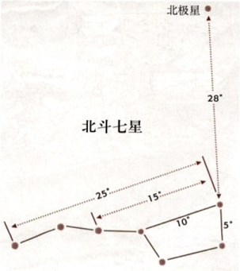

今年（2019年）8月13日英仙座流星雨迎来最大值。不过这一天也是农历七月十三，受到亏凸月的干扰，只有比较亮的流星可以看到。在等待流星的同时，不讲讲头顶的星星就太浪费了。稍微突击了一下如何在这仲夏夜认识夜空中明亮的星。

无论何时，北斗七星总是夜空中指路的明灯。找到北斗七星就能跟随它找到一大票明亮的恒星。恒星或星群之间的距离用度(°)来衡量，星空中简单的测量可以通过举起手臂，胳膊前伸来实现。
{:.center}
这个方法可以通过北斗七星来校准：
{:.center}
通过这种测量方法，结合星图可以快速定位多颗明亮的恒星。比如北极星就是勺斗两颗星向前延申五倍(28°),北极星附近附近也有几颗较暗的星构成一个小勺子，就是小熊座的一部分，北斗七星则是大熊座的一部分。顺着北极星再往前看就能找到 W 形状的五颗星就是仙后座。顺着北斗七星的勺柄就能找到大角星，也是天空中非常明亮的一颗星。

夏夜最耀眼的当属夏季大三角了，由织女星、牛郎星和天津四组成，可以通过北斗七星找到它。下面这个图比较重要，基本上记住它就可以了。
{:.center}
从靠近斗柄一侧的两颗斗勺恒星像开口方向约60°，就到了织女星和天津四的中点，其中更亮的是织女星。织女星与旁边的四边形构成天琴座，天津四则是北十字的一部分，牛郎星则构成天鹰座。

至于行星，位于月亮运行轨迹上，又很亮的基本上就是行星了。

其实这些拿手机上的星图软件比如 Sky Map 对比着一看基本上就能认出来了。只不过每次都要掏出手机对比半天，再半信半疑地说：看！那是xx星！比徒手一指：看！那那个W形状的五颗星星，是仙后座哦！显得B格要低就是了。
