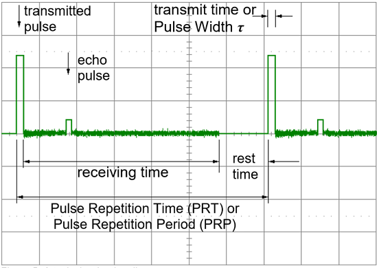

{:.center}

雷达技术的诞生，要从英国物理学家麦克斯韦说起(James Clerk Maxwell)。1865年，他证明了电场和磁场以波的形式并以恒定的光速在太空中传播。随后在1886年，赫兹(Heinrich Rudolf Hertz)发现了电磁波，从而证明了麦克斯韦理论。1897年，无线电通信领域的先驱马可尼(Guglielmo Marconi)，将电线连接到木杆上，实现了电磁波的长距离传输。1904年，德国工程师ChristianHülsmeyer发明了“望远镜”，用于对能见度较差的水域进行交通监控。这是第一个实用的雷达测试。1922年，美国海军研究实验室的美国电气工程师 Albert H. Taylor和 Leo C. Young首次找到了木制船。1930年，劳伦斯·海兰德（也是海军研究实验室的代表）首次找到了飞机。到1939年，英国已拥有高度秘密的无线电测向（RDF）站的防御链。1940年 在美国，俄罗斯，德国，法国和日本开发了不同的雷达设备。

雷达(RADAR)是Radio Detecting And Ranging的缩写，即无线电检测与测距。与激光测距、超声波测距的原理类似，雷达通过发射电磁波并检测回波来确定物体的方向和距离。现代的雷达可以从回波中提取更多的信息，但是通过测量延迟时间来计算距离仍然是雷达最重要的功能之一。

一部雷达大体上由以下几个部分构成，发射器(transmitter)：发射器产生短时高功率射频脉冲，脉冲通过天线进入到空间中。双工器(duplexer)：双工器在发射器和接收器之间交替切换天线，使他们共用一根天线。接收器(receiver)：接收器放大并解调接收到的信号。天线(antenna)：天线将发射机的能量传输到空间中，以及接收散射回波到接收机。指示器(display)：指示器应向观察者提供雷达目标相对位置的连续，易于理解的图形图像。一般就是雷达在图像中间，目标以极坐标的形式围绕周围。

{:.center}
雷达的很多功能都跟时间有关。上图是一个典型的雷达脉冲的timeline，两个发射脉冲之间的时间称为脉冲重复时间(pulse-repetition time,PRT),其倒数是脉冲重复频率(Pulse Repetition Frequency,PRF)，$PRT=\frac{1}{PRF}$。
雷达测量到的是雷达与目标的直接的距离，由$R = \frac{t_{delay}\cdot C_0}{2}$可以得到。其中$R$是距离，$t_{delay}$是电磁波发射到目标再返回的时间，$C_0$是光速，要求得水平距离。还需要知道目标的高度。

目标的角度信息通过天线的方向确定。具有高方向性的天线称为定向天线。测量接收回波时天线的指向，可以确定目标的方位角和仰角。角度测量的精度跟方向性有关，而方向性是天线尺寸的函数。
大多数雷达系统的天线被设计为以单向波瓣辐射能量。搜索雷达天线不断移动，波束指向目标时有最大的返回信号。武器控制和制导雷达系统定位在最大信号返回点，并通过手动或自动跟踪电路保持在该位置。为了准确确定方位角，有必要进行北向测量。以前用罗盘，现在可以借助GPS来确定北向。伺服系统控制雷达天线的朝向，现在更多的是通过相控阵天线进行电子扫描。

